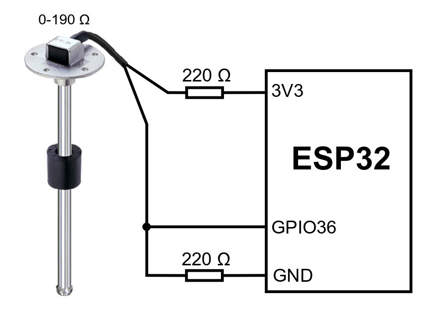
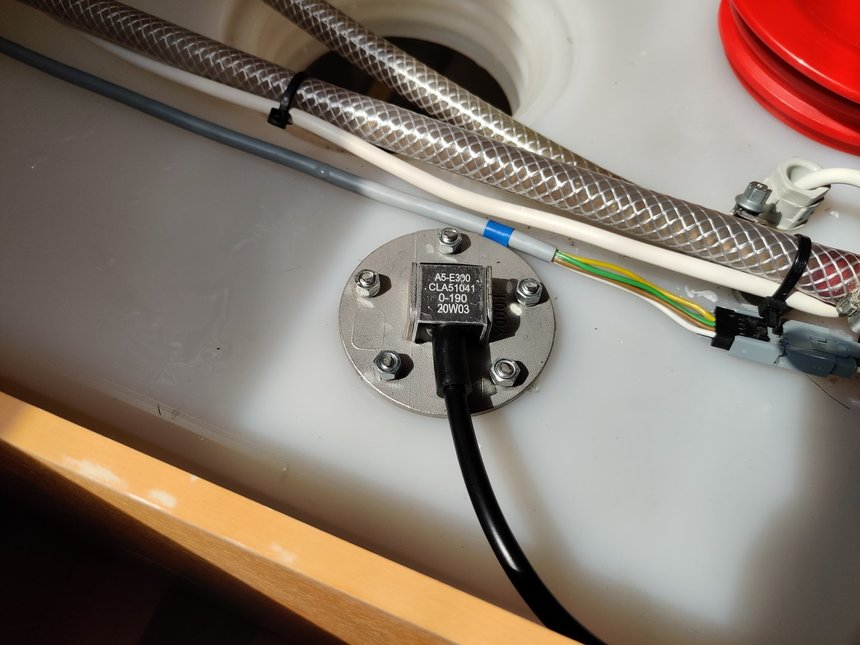

# An ESP32 based BLE beacon for liquid sensors

An ESP32 based BLE beacon that sends data from resistive liquid level sensor.

Sensors can be bought eg. from 
[Aliexpress](https://www.aliexpress.com/item/4000349189985.html)

The program sends 8 bytes of data in BLE ManufacturerData about every 5 seconds. The data format is:

- 2 bytes of Manufacturer ID 0x02E5 (Espressif Inc)
- 2 bytes for identifying this sketch: 0xE948 (E code for oxygen :)
- 1 byte containing the calculated value of the sensor (see later)
- 1 byte containing the converted value of the sensor (see later)
- 2 extra bytes as 0xBEEF because it's delicious

## Background

Motorhomes have usually capacitive sensors for the level of the fresh water tank. There are just four
metal sticks of different length and the meter or just several leds show water amount only as 
1/4, 1/2, 3/4 or full tank. I wanted to have a little more accurate meter AND get the data also elsewhere 
than the four led panel of the car.

## How it works

ESP32's ADC is not exactly linear, it has some bias and it can not measure voltages less than 0.1 or more 
than 3.2 volts. Because of that the sensor must have resistors both sides of it, to get the measured 
values to the middle of the full scale (0-4095). The sensor is not linear either and it is actually a 
resistor net, so it has nonlinear steps. Because of that the code reads the sensor 50 times sleeping 100 
ms between and calculates the average. Then the value is divided by 2000 to get a scale of values which 
are somewhere between 30 and 100.

Because resistors have tolerance too, this kind of instruments may have different scale and it 
must be calibrated. Also the water tanks may have shapes that water level is not directly proportional to the
volume of the water.

To get liters instead of a raw values, we need a conversion table. The table must be saved to SPIFFS with
filename table.txt. The format is: raw value, space, liters, newline. Eg. my sensor's readings are 33 when 
the float is on top and 49 when it is on the bottom. Then I can make a conversion table like this. 
This table is an example, its values have not been measured in real world yet.

<pre>
33 90
34 80
35 70
36 65
37 60
38 55
39 50
40 45
41 40
42 35
43 30
44 25
45 20
46 15
47 10
48 5
49 0
</pre>

The sketch prints the raw and converted values to the serial console every time when advertising.

## Circuit

